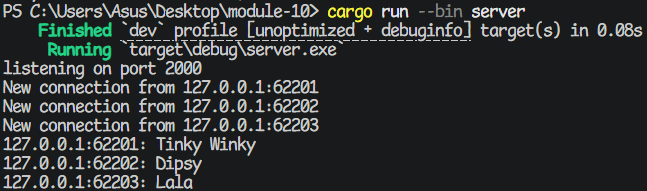
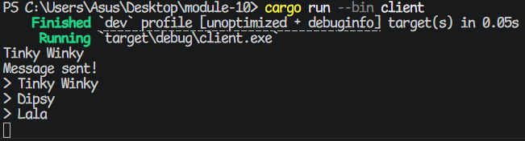
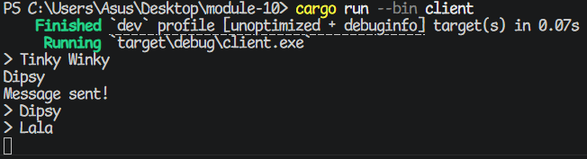
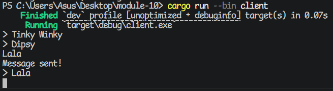

# 2.1

## Steps

* Run `cargo run --bin server` on one terminal.
* Next, run `cargo run --bin client` on three other separate terminals.
* On client #1, type `Tinky Winky` and press Enter.
* On client #2, type `Dipsy` and press Enter.
* On client #3, type `Lala` and press Enter.

## Results

Server terminal:


Client #1's terminal:


Client #2's terminal:


Client #3's terminal:


# 2.2

After changing the port number on the client side:

Filename: src/bin/client.rs

```rs
async fn main() -> Result<(), tokio_websockets::Error> {
    let (mut ws_stream, _) = // changed from 2000 to 8080 -------vvvv
        ClientBuilder::from_uri(Uri::from_static("ws://127.0.0.1:8080"))
            .connect()
            .await?;
    // --snip--
}
```

...we also need to change it on the server side:

Filename: src/bin/server.rs

```rs
async fn main() -> Result<(), Box<dyn Error + Send + Sync>> {
    let (bcast_tx, _) = channel(16);

    // this also changed -----------------------vvvv
    let listener = TcpListener::bind("127.0.0.1:8080").await?;
    println!("listening on port 8080"); // also change the log

    // --snip--
}
```
