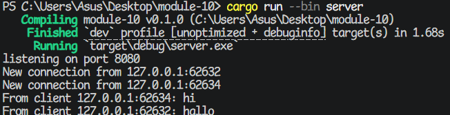
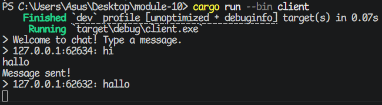
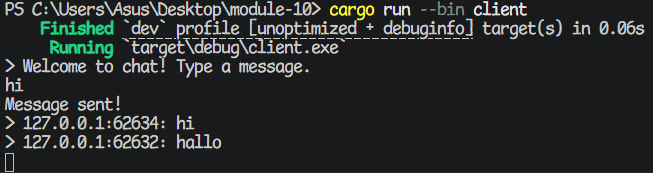

## 2.1

### Steps

* Run `cargo run --bin server` on one terminal.
* Next, run `cargo run --bin client` on three other separate terminals.
* On client #1, type `Tinky Winky` and press Enter.
* On client #2, type `Dipsy` and press Enter.
* On client #3, type `Lala` and press Enter.

### Results

Server terminal:


Client #1's terminal:


Client #2's terminal:


Client #3's terminal:


## 2.2

After changing the port number on the client side:

Filename: src/bin/client.rs

```rs
async fn main() -> Result<(), tokio_websockets::Error> {
    let (mut ws_stream, _) = // changed from 2000 to 8080 -------vvvv
        ClientBuilder::from_uri(Uri::from_static("ws://127.0.0.1:8080"))
            .connect()
            .await?;
    // --snip--
}
```

...we also need to change it on the server side:

Filename: src/bin/server.rs

```rs
async fn main() -> Result<(), Box<dyn Error + Send + Sync>> {
    let (bcast_tx, _) = channel(16);

    // this also changed -----------------------vvvv
    let listener = TcpListener::bind("127.0.0.1:8080").await?;
    println!("listening on port 8080"); // also change the log

    // --snip--
}
```

## 2.3

### Steps

* Run `cargo run --bin server` on one terminal.
* Next, run `cargo run --bin client` on two other separate terminals.
* On client #2, type `hi` and press Enter.
* On client #1, type `hallo` and press Enter.

### Results and explanation

Server terminal:


Client #1 terminal:


Client #2 terminal:


This time I only need to change the server's code. I mostly just changed one line to the `handle_connection` function. More specifically, I changed the argument to `bcast_tx.send()` to include the address (which contains both the IP and port number):

```rs
async fn handle_connection(/* --snip-- */) -> /* --snip-- */ {
    // --snip--
    loop {
        tokio::select! {
            incoming = ws_stream.next() => {
                match incoming {
                    Some(Ok(msg)) =>  {
                        if let Some(text) = msg.as_text() {
                            println!("From client {addr}: {text}");
                            bcast_tx.send(format!("{addr}: {text}"))?; // added this line
                        } else {
                            println!("{addr} sent an invalid message.");
                        }
                    }
                    // --snip--
                }
            }
            // --snip--
        }
    }
}
```

Note that before this, I was already printing the clients' addresses and port numbers, but only on the server side, as you can see on the line right above the line I marked.
